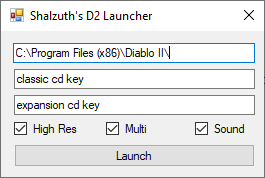
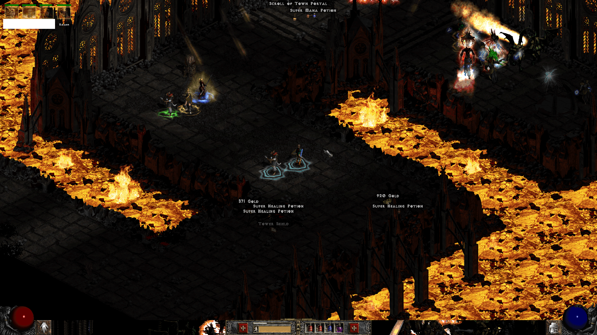

# D2Loader

Credits to [shalzuth](https://github.com/shalzuth/) for providing [sample code](https://github.com/shalzuth/D2Launcher)

[jaenster](https://github.com/jaenster) compilation

A simple multi d2 client, like was the old D2Loader for 1.10 in the past.

- download [D2Loader1.14.exe](https://github.com/blizzhackers-d2/d2tools/raw/master/d2loader/D2Loader1.14.exe)
- move it to your game folder
- on start it only alters the client for a second, and changes it back, so it will seem unchanged for d2 server.
- just put in your game folder, and make a shortcut to your desktop, add stuff like -w
- keep in mind by default, it starts without any option, so if you start normally it starts just fullscreen

