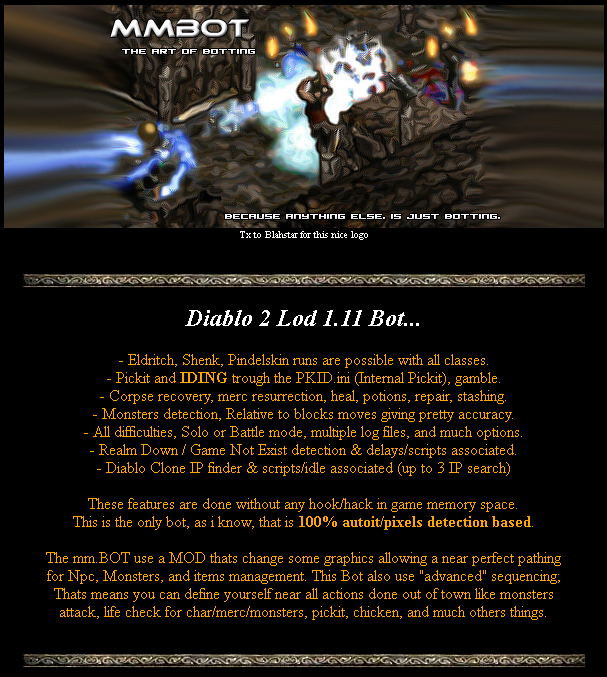

# Other tools

---
* [mmBOT](#mmBOT)

---

## mmBOT
* it's a diablo 2 bot 100% autoit/pixels detection based
* download [mmbot 5.44](http://www.gmstemple.com/michma/mmBOT544.Final.zip) or mmbot 5.45 from bhfiles Diablo II/1.11b - [mirror-1](https://mega.nz/#F!C2IWgYIL!Mn4eJY1gNMQZRZ72-Sj8SQ?qngSUAyY) [mirror-2](https://files.bnetdocs.org/bhfiles/Diablo%20II/1.11b/mm.BOT.545.zip)
* see [manual](https://github.com/blizzhackers/D2LoD-files/raw/master/other/assets/mm.BOT.manual.zip)

